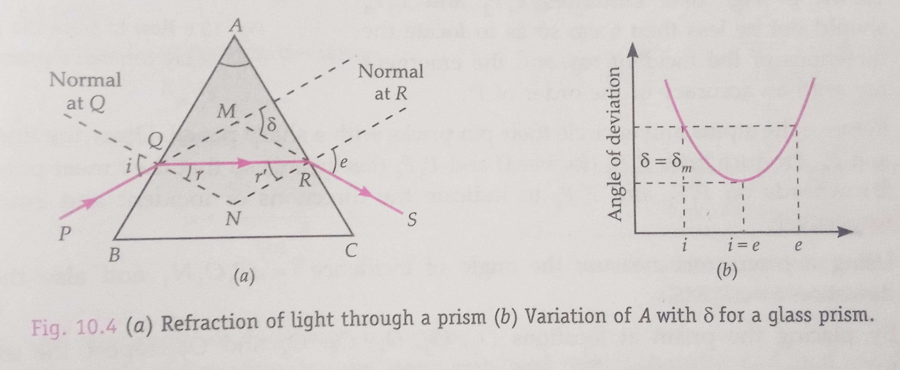
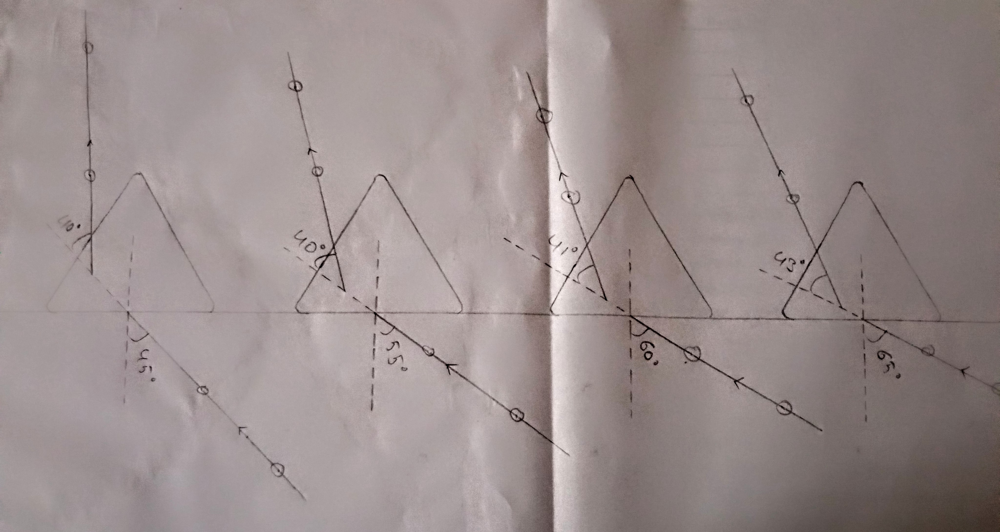
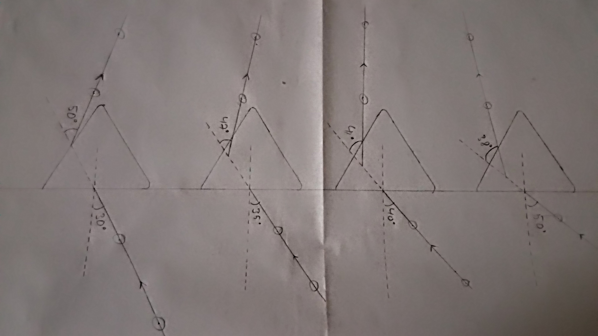
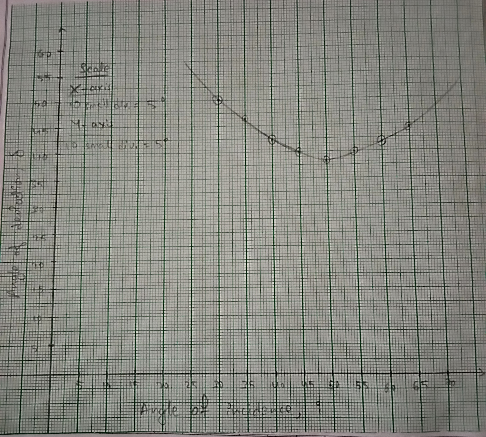

## Aim of the Experiment
To determine the angle of deviation of the glass prism by plotting a graph between angle of incidence and angle of deviation and hence to find the refractive index of the material of the prism. 

## Apparatus and Material Required 
1. Drawing board 
2. Triangular glass prism 
3. Alpins 
4. Drawing pins/adhesive tape 
5. Protractor 
6. Ruler 
7. White paper sheets 
8. Graph paper 

## Theory/Working Formulae 
1. When a ray of light passes through a prism, 
$$
\text{Angle of Prism} + \text{Angle of deviation} = \text{Angle of incidence} + \text{Angle of emergence} 
\\
A + \delta = i + e \implies \delta = i + e - A
$$

As $i$ increases, $\delta$ first decreases, becomes minimum and then increases. In the position of minimum deviation $\delta_m$, the ray of light passes symmetrically, i.e., parallel to the base so that $i = e$ and $r = r'$.

2. The relation between $\mu$ and $\delta_m$ is 
$$
\mu = \frac{\sin\frac{A+\delta_m}{2}}{\sin\frac{A}{2}}
$$

## Diagrams 
 

## Practical Record 
 
 

## Observations 
- Angle of prism, $A = 60\degree$

| S. No. | Angle of incidence, $i$ | Angle of deviation, $\delta$ | 
|:-:|:-:|:-:|
| 1. | $30\degree$ | $50\degree$ |
| 2. | $35\degree$ | $47\degree$ |
| 3. | $40\degree$ | $41\degree$ |
| 4. | $45\degree$ | $40\degree$ |
| 5. | $50\degree$ | $38\degree$ |
| 6. | $55\degree$ | $40\degree$ |
| 7. | $60\degree$ | $41\degree$ |
| 8. | $65\degree$ | $43\degree$ |

## Graph Plotting 
Choosing suitable scales, plot a graph between $i$ and $\delta$. Take angle of incidence $i$ along X-axis and angle of deviation $\delta$ along Y-axis. Draw free hand smooth curve passing through the maximum number of plotted points. 

Draw a tangent on the lowest point of the curved parallel on the X-axis. Read the angle of minimum deviation $\delta_m$ on the Y-axis of the graph. 

 

## Calculations 
- Angle of minimum deviation, $\delta_m = 38\degree$ 

$\therefore$ Refractive index, $\mu$ = $\frac{\sin A+\delta_m/2}{\sin A/2}$  
$\mu = \frac{\sin (\frac{60+38}{2})}{\sin 60/2}$  
$\mu = 1.509$

## Result 
1. As the angle of incidence increases, the angle of deviation first decreases, reaches a minimum value and then again increases, as is obvious from the $i$ versus $\delta$ graph. 
2. Angle of minimum deviation, $\delta_m$ = 38$\degree$
3. Refractive index of the prism material, $\mu$ = 1.509

## Precautions 
1. An ink mark should be put on the prism to distinguish the refracting angle A from the other angles and the same angle of prism should be used throughout.
2. The angle of incidence shouldn't be less than $30\degree$, as the ray mage the totally reflected inside the prism. 
3. Alpins should be fixed vertically and the pin pricks should be encircled immediately after they are removed. 
4. While fixing alpins, the feet of pins must be adjusted in the same straight line.
5. Indicate the path of the incident, the refracted and the emergent rays by arrowheads.

## Sources of Error 
1. Alpins may not be vertical. 
2. The feet of the alpins may not be in a straight line. 
3. the distances between the pins may be small. 
4. Position of the prism might have disturbed during a given set of observations.
5. Measurement of angles may not be accurate. 