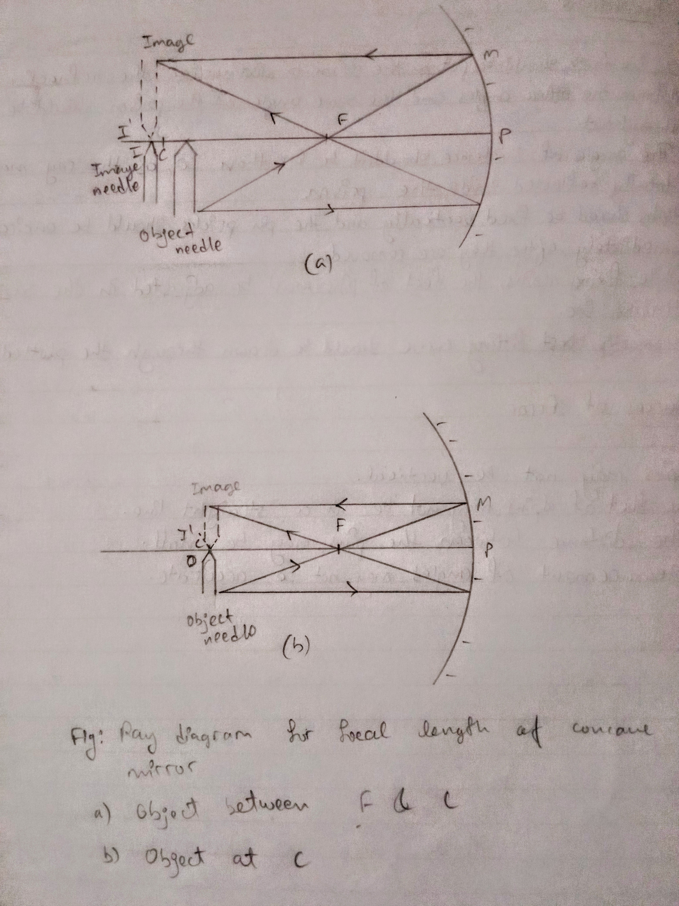
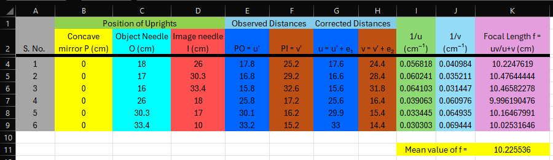

## Aim of the Experiment 
To find the value of v for different values of u in case of a concave mirror and find its focal length.

## Apparatus and Material Required 
1. Optical bench with three uprights
2. Two sharp edged needles 
3. One concave mirror of focal length less than 20 cm
4. Index needle/knitting needle 
5. Half-meter scale

## Working Formula 
The relation between object distance u, image distance v, and focal length f of a concave mirror is given by the mirror formula.

$$
\frac{1}{f} = \frac{1}{u} + \frac{1}{v} \text{ or } f=\frac{uv}{u+v}
$$

## Ray Diagrams 
 

## Observations 
- Rough focal length of concave mirror = 10 cm 
- Actual length of the knitting needle, x = 2.0 cm 
- Observed distance between mirror and object needle, y = 2.2 cm 
- Observed distance between mirror and image needle, z = 2.8 cm 
- Index correction for object distance u , $e_1$ = x-y = -0.2 cm 
- Index correction for image distance v, $e_2$ = x-z = -0.8 cm 

 

## Results 
- Focal length of concave mirror calculated from different u and v values as $f = \frac{uv}{u+v} = 10.67\ cm$

## Precautions 
1. Uprights should be rigid and vertical. 
2. Index corrections should be carefully determined and applied. 
3. The principal axis of the mirror should be horizontal and parallel to the length of the optical bench. 

## Sources of Error 
1. Uprights may not be vertical 
2. Parallax might not have been removed completely. 
3. Optical bench may not be parallel.