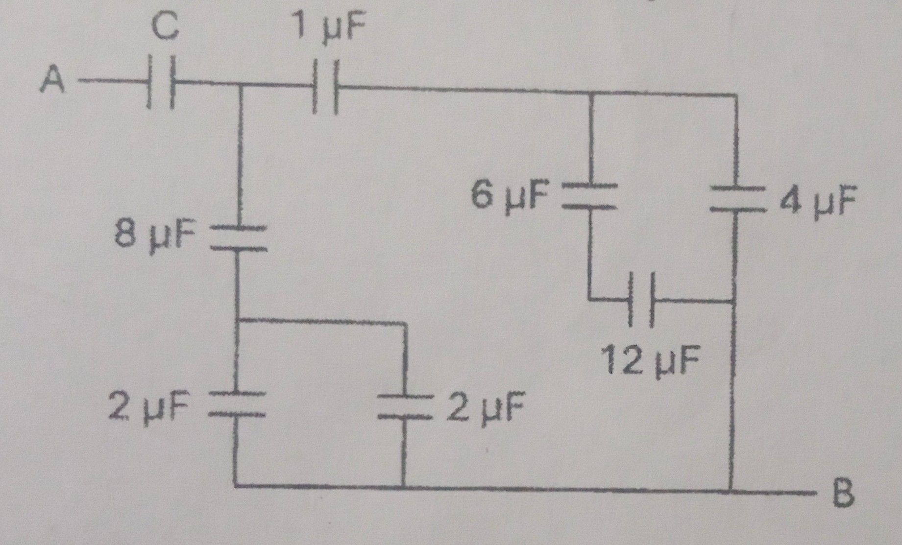

1. State the Gauss law and write its mathematical expression.

2. Write two factors on which the capacitance of a parallel plate capacitor depends.

3. A rectangular surface of area $20 m^2$ is placed in an electric field $\vec{E} = (\frac{5}{2}\hat{i} + \frac{3}{4}\hat{j} - 6\hat{k}) NC^{-1}$

4. Two point charges $+3 C$ and $-5 C$ are separated by 2 cm from each other. At what distance from the $3C$ charge will a point lie between the two charges such that the net potential at that point is zero?

5. What are equipotential surfaces? Draw the equipotential surfaces for: 
    1. Linear charge distribution
    2. Charged sphere

6. Derive the expression for equivalent capacitance of series combination of capacitors. **OR** Derive the expression for torque acting on an electric dipole placed in a uniform electric field.

7. Find the value of $C$ if the equivalent capacitance between the points A and B in the given circuit is $1\ \mu F$

8. Derive the expression for electric field due to a uniformly charged sphere by using Gauss law at a point: (1+2)
    1. Inside the charged sphere
    2. Outside the charged sphere

9. Calculate the net electrostatic force on the 1 µC charge placed at the body centre of a cube of sides 2 cm due to all other charges placed at the vertices as shown in the figure.

OR  

Derive the expression for electric field at a point due to a uniformly charged rod without using Gauss law.

10. In the given figure, find the net flux through the cube of side 2a' and the charge enclosed by the cube.  
- Given:
    - $E_x = \alpha x$
    - $E_y = \beta y$
    - $E_z = 0 $
    - Where, $\alpha = 50 NC^{-1}m^{-2}$, $\beta = 20 NC^{-1}m^{-2}$ and $a = 0.1 m$

